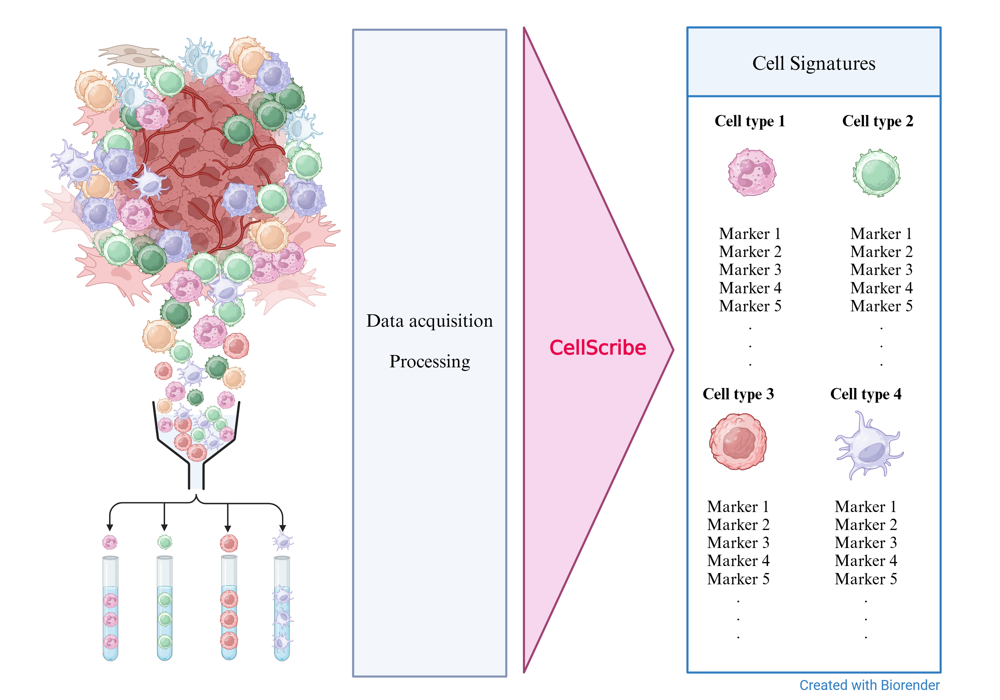

# CellScribe
Generation of molecular signatures for cell types from sorted cell proteomics data

# Introduction
Cellular signatures are sets of molecular markers that describe or characterize a specific cell type and are used to resolve cell types from complex data, identify cell types, and analyze the differential expression of cell type-specific molecules in different conditions. This program will receive a processed expression matrix of several sorted cell population samples and output a set of molecules that characterize each cell type that appears in the matrix.



## Requirements
### Input requirements
The user should be able to provide an expression matrix for the program with sorted cell populations

### Software requirements
Python 3.7 ->

### Packages
```
pandas
numpy
itertools
scipy
scikit-learn
```

# Algorithm
1. Program reads an expression matrix file (.csv format)

2. Hierarchical clustering of the data and selection of cluster-specific high-abundance molecules

3. Principal component analysis and selection of molecules contributing most to the uniqueness of the cell type (variation)

4. Pairwise comparison between all cell types using statistical method and aggregating results for each cell type

5. Consensus signature - combine signature hits from each approach to establish a robust signature for each cell type

# Execution
## Installation
```
pip install -r requirements.txt
```
```
git clone https://github.com/iinaraz/CellScribe
```

## Input
Expression matrix


## Running the program
```
# Navigate to the CellScribe repository
cd <path_to_repository>

# Run CellScribe from command line
python CellScribe.py <filename>
```

## Output
A table with columns <Celltype> <Marker> <Value>

The value will describe the strength of the specific molecule as a signature marker based on the features analyzed.

## Information

This program and the Github repository was written by Iina Raz. The project was done as a part of a [Python Programming Course](https://github.com/szabgab/wis-python-course-2024-11) at the Weizmann Institute of Science.

